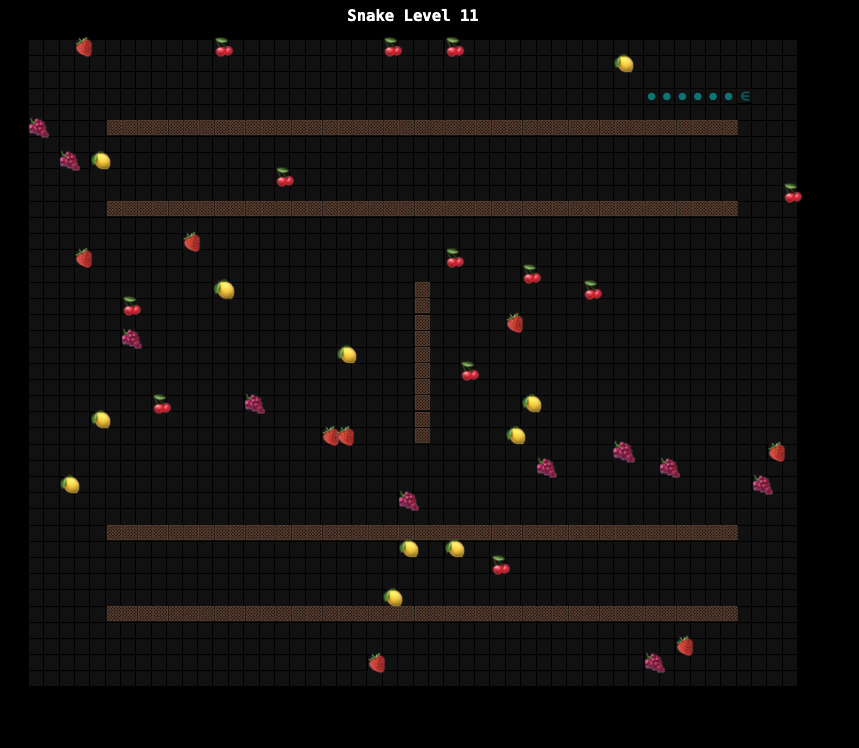

# Snake

[snake.alexanderbird.software](http://snake.alexanderbird.software/)

A vanilla JavaScript snake game.

I started this on an airplane without internet, and I challenged myself to build
a minimalist snake game without frameworks or documentation. All I had was the
sample code that was already on my laptop.

Now that I'm connected to the internet again, I'm sticking to the following
constraints:
- no build step
- no libraries

It's been an interesting exercise to figure out what I miss most about modern
tooling. Here are the things I miss most:

1. Splitting my code into separate files
    - it's much easier to navigate between files than to scroll up and down in a
      file.
2. Unit tests
    - when I restructure the code, I feel worried that something is broken. I
      don't have this stress when I'm TDDing my code.
3. Types
    - A type-checking build step gives me more confidence that everything is wired
      up correctly.
4. Abstracting away the rendering process
    - it's not too bad to set and update HTML directly, but it does make me
      appreciate how I don't have to think about that low level detail when I'm
      using a UI framework.
